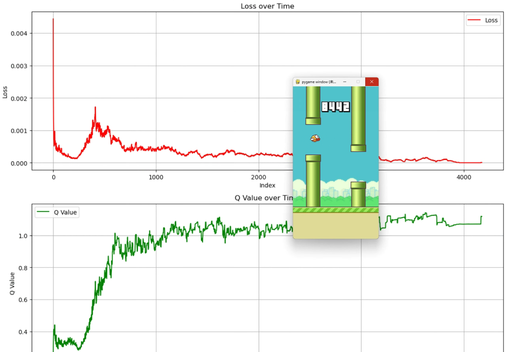
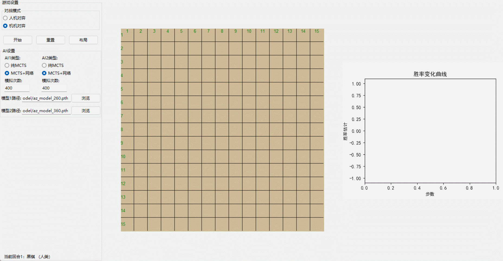
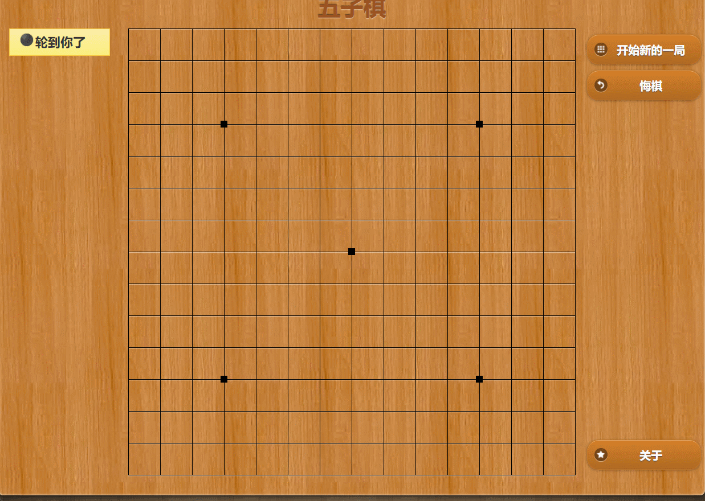

# 强化学习实践案例源码
章节内容参考书籍:
1. 《强化学习》（作者：邹伟 鬲玲 刘昱杓），章节设置与本书保持一致
2. 《深度强化学习理论与实践》（作者：龙强 章胜），主要参考了策略梯度相关算法

## 1. 环境配置

python版本：第7章FlappyBird游戏需要python3.8，其他章节使用python3.10

## 2. 章节目录

前两章是纯理论介绍，没有代码实现。

文件夹名字与各章节对应，如第3章的代码在文件夹ch03_动态规划下。

第3章到第6章都是比较简单的，都是离散状态空间和离散动作空间的走迷宫（网格世界）。

### 第7章 值函数逼近

ch07_值函数逼近，实现了多个版本的DQN算法，包括DQN、Double DQN、Prioritized Replay DQN、Dueling DQN、Noisy DQN、Rainbow DQN，训练了FlappyBird游戏。

FlappyBird游戏包括两个版本，一个是纯数值版本FlappyBird-v0，另一个是图像版本FlappyBird-rgb。

训练效果：
1. FlappyBird-v0版本，最高分可以达到8442分，大概训练半天，但并不稳定，平均也就几百分左右；
2. FlappyBird-rgb版本，最高分可以达到600多分，大概训练一天，但并不稳定，平均也就60分左右；

### 第8章 随机策略梯度

ch08_随机策略梯度，实现了REINFORCE和带基线的REINFORCE算法，训练了小车上山游戏MountainCar-v0。

### 第9章 Actor-Critic及变种

ch09_Actor-Critic及变种.

实现了A2C，训练了CartPole-v0。

实现了A2C+优先经验回放，A3C算法，训练了Pendulum-v1。单纯的A2C无法训练Pendulum-v1。

### 第10章 策略梯度进阶

ch10_策略梯度进阶--确定性策略梯度，最大熵，PPO等

1. 实现了确定性策略梯度算法DDPG，用于训练Pendulum-v1。
2. 实现了基于最大熵的AC，即SAC(Soft Actor-Critic)，用于训练Pendulum-v1。
3. 实现了基于最大熵的A2C，即S2AC，用于训练Pendulum-v1。
4. 实现了基于最大熵的A3C，即S3AC，用于训练Pendulum-v1。
5. 在SA3C的基础上，增加了PPO的目标函数裁剪，用于训练Pendulum-v1，比纯粹的SA3C训练的更快、更稳定。虽然尝试过单独实现PPO，但是效果不好，不能保证每次都能成功训练Pendulum-v1。
6. 实现了TD3，这是对DDPG的改进，用于训练Pendulum-v1。
7. 后续如果有时间，还打算实现DPPO、D4PG等算法。（未完）

### 第11章 学习与规划

ch11_学习与规划，实现了基于模型的强化学习算法，包括Dyna-Q、Dyna-Q+、Prioritized_Sweeping_Dyna-Q、Dyna-2，训练了比较简单的迷宫游戏，没有特别深入，本章主要是为了后续的AlphaZero算法打下基础。

### 第12章 探索与利用

ch12_探索与利用，实现了包括Epsilon-Greedy、UCB、Thompson Sampling，训练了比较简单的多臂赌博机，没有特别深入。

### 第13章 博弈强化学习

ch13_博弈强化学习：
1. 实现了AlphaZero算法([AlphaZero.py](ch13_博弈强化学习/AlphaZero.py))，训练了五子棋游戏，包括9x9棋盘和15x15棋盘，使用完全一样的神经网络类；
2. 实现了带UI界面的五子棋游戏([GomokuGame.py](ch13_博弈强化学习/GomokuGame.py))，可选择“人机模式”和“机机模式”对训练好的模型进行评估测试，还能观察胜率变化曲线；

3. 实现了基于opencv视觉检测的五子棋自动对战程序([GomokuAutoByVision.py](ch13_博弈强化学习/GomokuAutoByVision.py))，可以用于网络上或其他的五子棋软件，自动识别框选区域的棋盘和棋子，可以与别人的AI或真人进行对战，进一步评估模型的强弱；

4. 实现了批量模型评估程序([model_evaluate.py](ch13_博弈强化学习/model_evaluate.py))，可以对任意选定的两个模型进行批量对战，并统计胜/负/平的局数，用于评估模型强弱。

#### 超参数及硬件配置

1. 9x9棋盘训练迭代次数300次左右能打败人类，每步的MCTS模拟次数为400，每次迭代自我博弈并行的游戏局数是5；
2. 15x15棋盘训练迭代次数400次以上能打败人类和传统算法的电脑，训练时MCTS模拟次数为800，每次迭代自我博弈并行的游戏局数是2；在网上与其他Ai进行实战评估时，先手每步的MCTS模拟次数为400，后手每步的MCTS模拟次数为1500，原因是后手的劣势太大，需要更高的模拟次数。
3. 自我博弈生成数据时，神经网络预测使用的是CPU，因为网络结构较为简单，并且传统的MCTS是每个节点依次顺序评估，用GPU反而会很慢；
4. 训练时，由于是批量训练，需要使用GPU，但由于训练间隔较长，大部分时间都在自我博弈，所以GPU的压力不大，不需要用太好的显卡，比如RTX 2060也能训练，对效率不会有明显的影响；

需要注意的是，我的个人电脑配置较好，CPU是7950X3D，GPU是RTX 4090，内存是64G，我的实现对CPU和内存要求较高，对GPU要求不高，比如我笔记本的RTX 2060也完全可以；如果CPU和内存配置较差，可以适当调整超参数，但训练速度会慢很多。

#### 9x9棋盘和15x15棋盘进行对比：

1. 9x9棋盘训练时间短很多；
2. 9x9棋盘训练到后期，非常容易出现平局，先手和后手的胜率差距不大，几乎可以根据平局的数量来判断训练收敛程度；
3. 15x15棋盘，先手胜率会远远高于后手，也很难出现平局；
4. 9x9棋盘在训练期间，可以周期性的开启评估测试，用于筛选最强的模型，因为不会耽误太多时间；
5. 15x15棋盘，如果开启评估测试，会耗费很多时间，所以不建议开启，一般默认训练次数最多的模型就是最强模型，虽然不够严格，但实测不会差太多。

#### 与原始AlphaZero不同的地方：

1. MCTS使用了树重用，即每步搜索结束后，不会抛弃树，而是保留树，这样下一轮搜索时，可以继续使用上一轮搜索的结果，这样在相同的模拟次数时，可以搜索更多节点，搜索结果更准确；
2. 自我博弈时，使用了悔棋回退技术，在确定胜负结果后，会回退两步，并增大模拟次数，继续探索其他分支，看看是否能得到不同的胜负结果，结合树重用技术，可以搜索更多节点，可以让生成的数据对应的胜负标签更准确，并得到更准确的策略分布；但需要注意树重用对内存的需求较大，所以需要根据硬件配置适当调整回退次数、自我博弈的并行游戏局数以及保留的父节点数量，否则会内存溢出；
3. 数据增强，在自我博弈时，会随机翻转/镜像棋盘，这样可以让生成的数据更丰富，并得到更准确的策略分布，这在AlphaGo Zero中使用过。在但AlphaZero中为了通用性而放弃了，但我们只是训练五子棋，不用太在意通用性；
4. MCTS选择节点阶段，会先模拟下一步是否会导致游戏结束，如果会导致游戏结束（赢或平局），则优先选择这些节点，这样可以避免毫无意义的探索，避免生成太多无用的数据，在训练初期也可以学得更快；